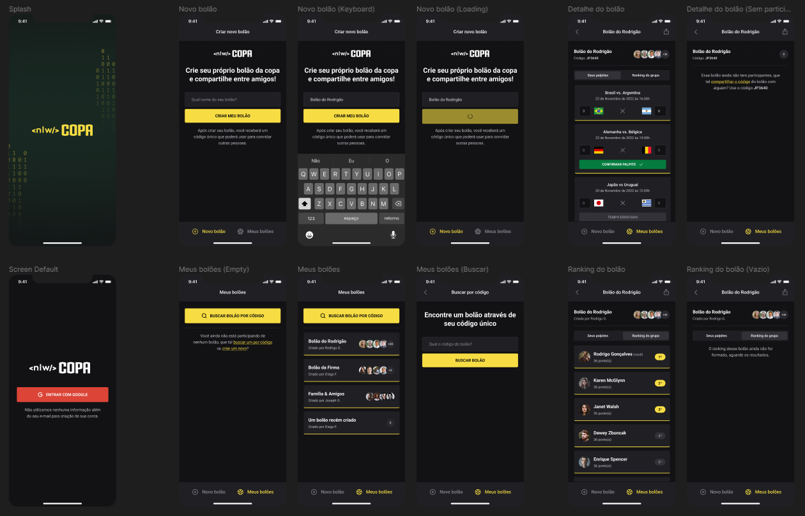

# NLW COPA - Ignite Track | Rocketseat

### Project created during the <strong>NLW COPA</strong> event, where a web and mobile platform was developed to create pools and make predictions for the World Cup games.

<hr>

<p align="center">
  <a href="#-technologies-used">Technologies</a> - 
  <a href="#-web-application-results">Web Application Results</a> - 
  <a href="#-mobile-application-results">Mobile Application Results</a> - 
  <a href="#-how-to-run">How to Run</a>
</p>

<a id="-technologies-used"></a>

## Technologies Used

- JavaScript
- TypeScript
- Tailwind CSS
- Node.js
- React
- React Native
- Expo
- Express.js
- HTML5
- CSS3
- Hoppscotch
- Prisma
- SQLite
- ts-node-dev

<a id="-web-application-results"></a>

## Web Application Results


<a id="-mobile-application-results"></a>

## Mobile Application Results



<a id="-how-to-run"></a>

## How to Run

To run the applications, follow the steps below:

### Server

- First, navigate to the `server` directory with the command:
  ```bash
  cd server
  ```
- Install the backend dependencies:
  ```bash
  npm install
  ```
- Start the backend with the command:
  ```bash
  npm run dev
  ```

With the backend running, you can choose to run either the web or mobile application.

### Web Application

- Navigate to the `web` directory with the command:
  ```bash
  cd web
  ```
- Install the web application dependencies:
  ```bash
  npm install
  ```
- Start the web application with the command:
  ```bash
  npm run dev
  ```

### Mobile Application

- Navigate to the `mobile` directory with the command:
  ```bash
  cd mobile
  ```
- Update the IP addresses in the `SCREENS` folder within the `GAME` and `HOME` components. Insert your machine's IP address in the `index.ts` files of these two components.
- Install the mobile application dependencies:
  ```bash
  npm install
  ```
- Start the mobile application with the command:
  ```bash
  expo start
  ```

The "server" application integrates with both the "web" and "mobile" applications, handling the backend. To run the applications, start the server first and then the respective application:

For the web application:
```bash
npm run dev
```

For the mobile application, use:
```bash
expo start
```
```

This version of the `README.md` focuses on the names of the technologies used and displays the results images for the mobile, web, and server applications.
